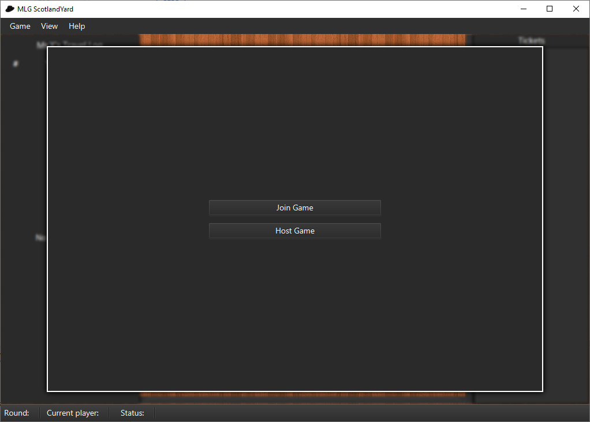
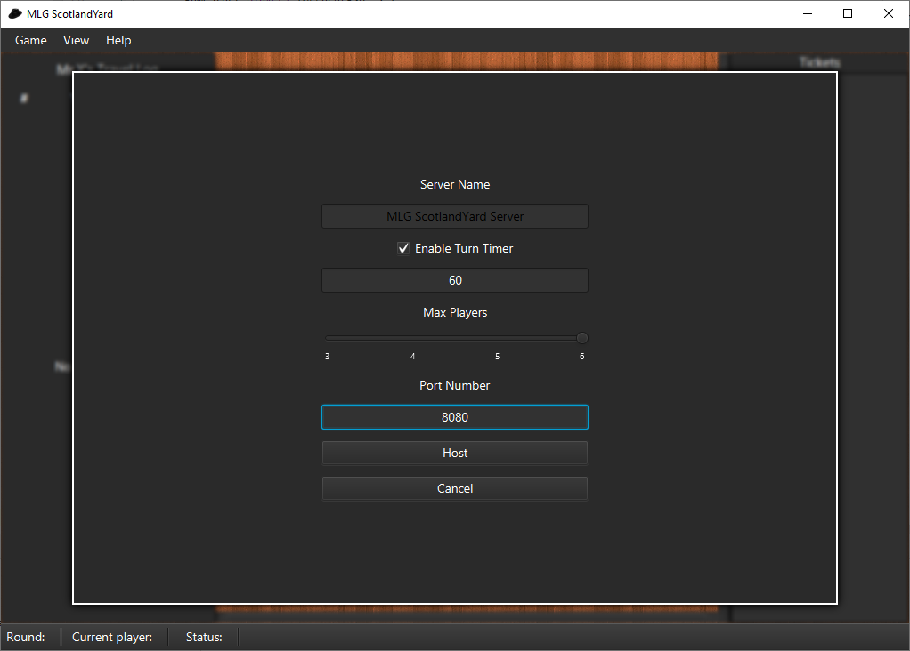
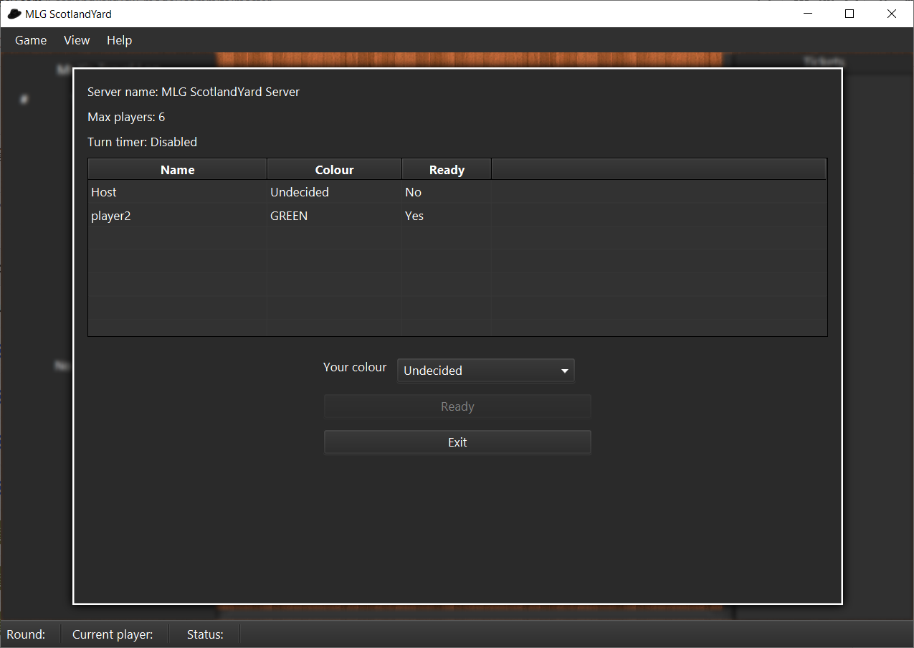

# Scotland Yard

Bristol COMS10009_2018 Object Oriented Programming (Y1) \
Pair project: [@jacob-pro](https://github.com/jacob-pro) [@Nimanao](https://github.com/Nimanao)

Confirmed mark: 77 (as part of a larger submission)

A Java implementation of the Scotland Yard Board Game.

## Background

The skeleton code was provided as part of the assignment (commit 893bdac8d1), the primary task of this 
coursework was to write the `ScotlandYardModel` class to pass the provided unit tests.

However I have also developed an extension to the game to support online/networked multiplayer gameplay 
using websockets.

The extension intentionally does not modify any of the original skeleton code. 
There are therefore two `main` implementations; the `Main` class launches the unmodified Bristol version, 
and the `MLGMain` (and associated classes) which launches the custom multiplayer version. 

## Usage

```
mvn clean compile exec:java@original
```

```
mvn clean compile exec:java@multiplayer
```

## Screenshots






